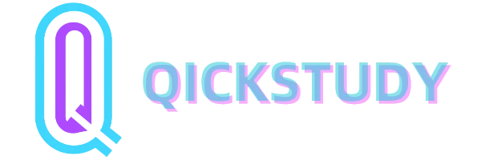

# QickStudy V2

本项目基于 [QickStudy](https://github.com/C4skg/QickStudy) 项目进行重构

由于项目开发属于个人兴趣爱好，所以重构的目的是为了更好的适应后续的开发，提升代码质量和可维护性。
因此，本项目也引入了编码规范文档，以此更便于后期review，具体规范详见 [specification.pep8.md](./specification.pep8.md)

### 前端项目

详见 [QickStudyV2-Web](https://github.com/C4skg/QickStudyV2-Web) 项目

### 后端项目（本项目）

服务器端的配置请看 [Flask-README.md](/api/README.md)

### 参考

1. https://github.com/miguelgrinberg/flasky